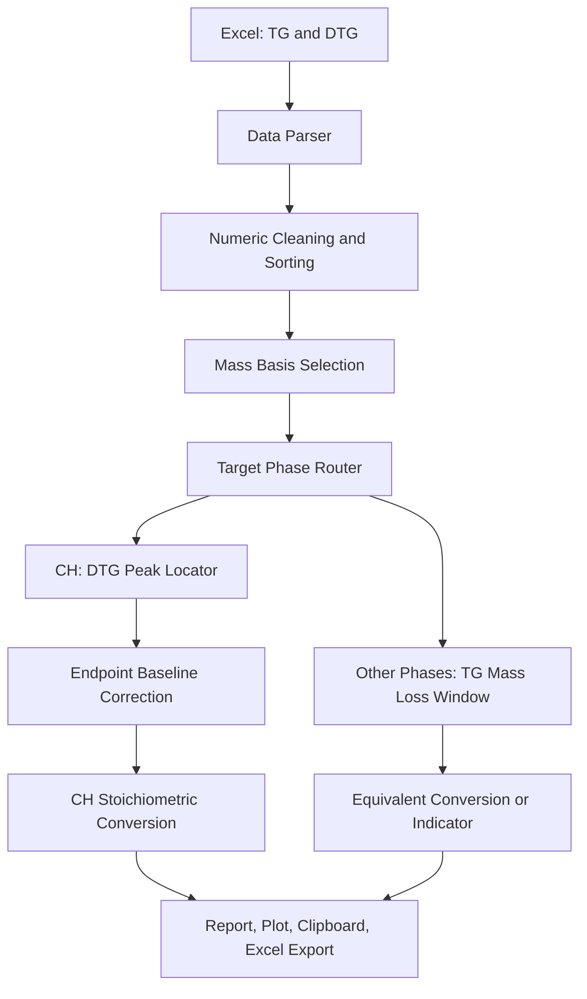
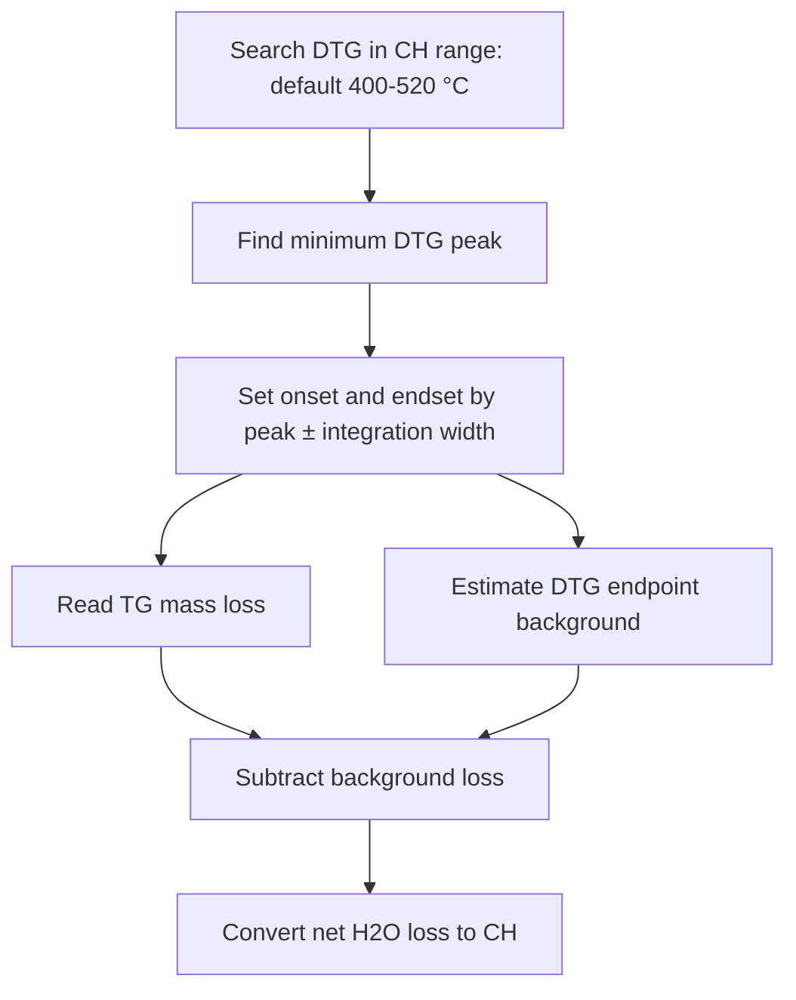
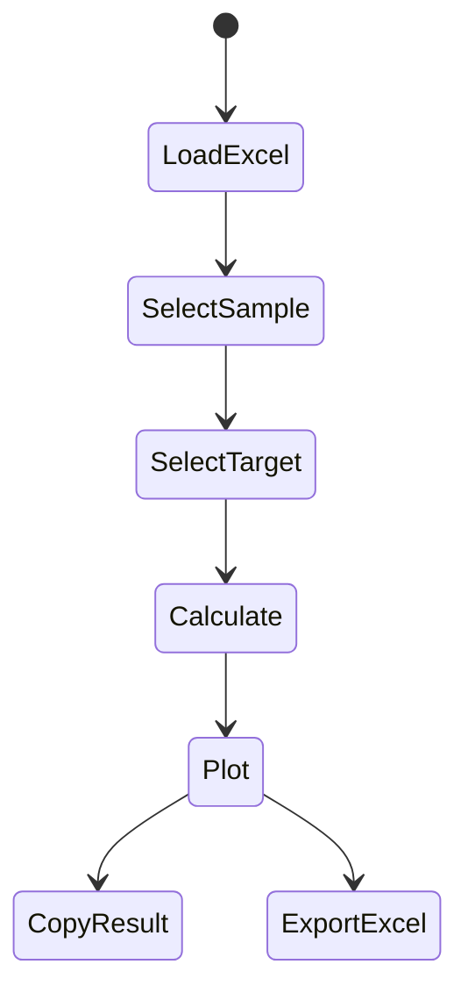

# TGA-CH-Analyzer Pro


**TGA-CH-Analyzer Pro** 是一个面向水泥基材料、ECC、UHPC、海洋服役材料与多胶凝材料体系的 **TGA/DTG semi-quantification workstation**。项目核心目标不是简单地“画热重曲线”，而是将 TG/DTG 曲线中的关键失重区间转化为可复现、可追踪、可解释的 **hydration products indicators**。

本项目采用以下计算框架：

```text
TG mass loss interpolation
+ DTG-guided endpoint baseline correction for CH
+ phase-specific temperature window extraction
+ stoichiometric conversion
+ cautious scientific interpretation
```

> **Scientific boundary**  
> TGA is powerful but not omnipotent. 本工具适合作为水泥基材料 TGA 的可视化、可复现、可调参数半定量分析工具。对于低温重叠峰、AFm/AFt/C-S-H 叠加信号、碳酸盐来源复杂样品，应结合 XRD、FTIR、TG-MS、NMR、SEM-EDS 或 thermodynamic modelling 进行交叉验证。

---

## 1. Project Positioning

| Module | Output | Meaning | Recommended Interpretation |
| :--- | :--- | :--- | :--- |
| CH / Portlandite | `CH Net (%)` | Ca(OH)2 脱羟基失水，经端点背景扣除后换算 | 用于比较不同胶凝材料体系中的 portlandite generation / consumption |
| CaCO3 equivalent | `CaCO3 (%)` | CO2 失重按 CaCO3 化学计量换算 | 用于碳化程度或碳酸盐当量含量表征 |
| Friedel's salt equivalent | `Fs (%)` | 指定温区失水按 Friedel's salt 当量换算 | 只建议表述为 Friedel's salt equivalent content |
| Bound water / Wn | `Wn (%)` | 105 °C 以上总失重并扣除 CO2 干扰 | 用于水化程度相关分析，不等同于全部水化产物含量 |
| Low-temperature hydrate index | `Hydrate Index (%)` | 50–200 °C 低温失重 | 仅作为同批次样品横向比较指标 |

---

## 2. Data Protocol

Excel 输入文件需要采用双 Sheet 结构：

| Sheet | Content | Layout |
| :--- | :--- | :--- |
| Sheet 1 | TG curve | 每两个列为一组：`Temp`, `TG` |
| Sheet 2 | DTG curve | 每两个列为一组：`Temp`, `DTG` |

数据行列约定：

| Rule | Description |
| :--- | :--- |
| Sample name row | Excel 第 3 行，即 pandas index 2 |
| Data start row | Excel 第 4 行，即 pandas index 3 |
| Column layout | 每个样品占两列：temperature column + value column |
| Cell rule | 不使用合并单元格，不在样品组之间插入空列 |

如果 Excel 中出现重复样品名，程序会自动追加后缀，例如 `Sample`、`Sample_2`、`Sample_3`，避免后一个样品静默覆盖前一个样品。

---

## 3. Computational Architecture



核心数据流遵循以下逻辑：

```text
Raw TG/DTG
  -> numeric cleaning
  -> temperature interpolation
  -> mass-basis handling
  -> phase-specific mass loss extraction
  -> CH endpoint baseline correction when needed
  -> stoichiometric conversion or indicator output
  -> visual plot and Excel-ready report
```

---

## 4. Mass Basis and Normalization

TGA 数据最容易出错的地方不是摩尔质量系数，而是 **mass basis**。本项目核心计算层支持三种质量基准：

| `ref_mode` | Formula | Use Case |
| :--- | :--- | :--- |
| `as_input` | `loss = m_start - m_end` | TG 已由仪器导出为百分质量时使用，例如 100, 99.5, 98.7 |
| `normalize_105` | `loss = (m_start - m_end) / m_105 * 100` | 以 105 °C 干燥质量作为基准，适合原始质量或需统一 dry basis 的数据 |
| `normalize_600` | `loss = (m_start - m_end) / m_600 * 100` | 以 600 °C 剩余质量近似 binder/paste basis，需结合实验目的谨慎使用 |

数学形式为：

```math
\Delta W_{T_1-T_2}^{ref}=\frac{m(T_1)-m(T_2)}{m_{ref}}\times 100
```

其中：

- `as_input`: 若 TG 已为百分质量，直接使用仪器给出的百分质量差；
- `normalize_105`: `m_ref = m(105 °C)`；
- `normalize_600`: `m_ref = m(600 °C)`。

> **Current GUI default**  
> 当前 GUI 默认采用 `as_input`，适用于 TG 已经由仪器导出为百分质量的情况。如果 TG 是 mg 或其他原始质量单位，建议在核心 API 中使用 `normalize_105`，或后续在 GUI 中加入 `ref_mode` 选择框。

---

## 5. CH / Portlandite Calculation

氢氧化钙 / Portlandite 的脱羟基反应为：

```math
Ca(OH)_2 \rightarrow CaO + H_2O\uparrow
```

CH 的基础化学计量换算为：

```math
CH(\%)=\Delta W_{H_2O}\times\frac{M_{Ca(OH)_2}}{M_{H_2O}}
```

采用摩尔质量：

```math
\frac{M_{Ca(OH)_2}}{M_{H_2O}}=\frac{74.09}{18.02}\approx4.11
```

### 5.1 DTG-guided endpoint baseline correction

本项目对 CH 使用 **DTG-guided endpoint baseline correction**：



当前默认 CH 寻峰区间为：

```text
400-520 °C
```

软件先在该区间内寻找 DTG 最小值作为 CH 峰位，再根据积分半宽 `integration_width` 确定起止温度：

```math
T_{start}=T_{peak}-w
```

```math
T_{end}=T_{peak}+w
```

其中 `w` 为 integration half-width，GUI 默认值为 40 °C。

### 5.2 Calculation equations

总失重为：

```math
\Delta W_{total}=m(T_{start})-m(T_{end})
```

端点背景损失估计为：

```math
\Delta W_{bg}=\frac{|DTG(T_{start})|+|DTG(T_{end})|}{2\beta}\times(T_{end}-T_{start})
```

净 CH 脱羟基失水为：

```math
\Delta W_{net}=\max(0,\Delta W_{total}-\Delta W_{bg})
```

最终 CH 结果为：

```math
CH_{net}(\%)=\Delta W_{net}\times\frac{74.09}{18.02}
```

其中 `β` 为 heating rate，通常单位为 °C/min。

> **Important DTG unit assumption**  
> 当前 CH 背景扣除公式默认 DTG 是基于时间的质量损失速率，例如 `%/min` 或 `mg/min`。如果仪器导出的 DTG 已经是基于温度的导数，例如 `%/°C` 或 `mg/°C`，则背景项不应再除以 heating rate。使用前请确认仪器导出的 DTG 单位。

> **Interpretation note**  
> CH 结果适合比较不同胶凝材料体系中的 portlandite generation / consumption。对于 C-S-H 持续脱水造成的背景漂移，本项目采用端点背景进行修正，但论文中仍应说明峰区间、积分半宽、升温速率、气氛与基线方法。

---

## 6. CaCO3 Equivalent Calculation

碳酸钙分解反应为：

```math
CaCO_3 \rightarrow CaO + CO_2\uparrow
```

默认参考温区为 600–800 °C。不同仪器、气氛、升温速率、样品粒径、碳酸盐晶型和胶凝材料体系可能导致峰位移动，因此该温区应根据 DTG 曲线进行确认。

```math
CaCO_3(\%)=\Delta W_{CO_2}\times\frac{M_{CaCO_3}}{M_{CO_2}}
```

```math
\frac{M_{CaCO_3}}{M_{CO_2}}=\frac{100.09}{44.01}\approx2.27
```

> **Interpretation note**  
> 如果样品含有石灰石粉、碳酸盐填料、未反应碳酸盐或外源碳酸盐，该结果应表述为 **CaCO3 equivalent content**，不应直接等同于“碳化生成的 CaCO3”。

---

## 7. Bound Water / Non-Evaporable Water

结合水 / 非蒸发水计算的关键是避免把 carbonate decomposition 中的 CO2 误判为水化产物失水。

当前 GUI 默认采用 **exclude CO2 mode**：

```math
W_n=\Delta W_{105-1000}-\Delta W_{CO_2}
```

核心函数也支持 **Bhatty-style water-equivalent correction**：

```math
W_n=\Delta W_{105-1000}-\Delta W_{CO_2}+0.41\Delta W_{CO_2}
```

其中：

```math
0.41=\frac{M_{H_2O}}{M_{CO_2}}=\frac{18.02}{44.01}
```

两种模式的含义不同：

| Mode | Expression | Meaning |
| :--- | :--- | :--- |
| `exclude_co2` | total loss minus CO2 loss | 从 105–1000 °C 总失重中排除碳酸盐 CO2 干扰 |
| `bhatty` | total loss minus CO2 plus water-equivalent term | 当 CO2 信号被解释为 Ca(OH)2 碳化相关损失时，进行水当量修正 |

> **Boundary condition**  
> Bhatty-style correction 主要适用于将 CO2 信号解释为 carbonation-related CO2 loss 的场景。如果体系中含有石灰石粉、碳酸盐填料或其他外源碳酸盐，修正后的 Wn 只能作为谨慎解释的指标，不应直接等同于真实非蒸发水绝对含量。

---

## 8. Friedel's Salt Equivalent

Friedel's salt 与 chloride binding 有关。TGA 中常以特定温区的失水进行当量换算。

默认参考温区为 300–380 °C：

```math
Fs(\%)=\Delta W_{H_2O,300-380}\times\frac{M_{Fs}}{6M_{H_2O}}
```

```math
\frac{M_{Fs}}{6M_{H_2O}}=\frac{561.3}{6\times18.02}\approx5.19
```

> **Important**  
> 300–380 °C 可能与 AFm、C-A-S-H 或其他含铝水化相发生重叠，因此建议写作 **Friedel's salt equivalent content**，不要表述为绝对纯相含量。

---

## 9. Low-Temperature Hydrate Loss Index

50–200 °C 区间常包含 C-S-H、AFt、AFm、吸附水、部分物理结合水和其他低温脱水信号。仅凭 TGA 很难把这些组分完全分离。

因此本项目将该结果定义为：

```math
Hydrate\ Loss\ Index=\Delta W_{50-200}
```

推荐论文表述：

```text
The low-temperature mass loss index was used as a semi-quantitative indicator
for comparing early dehydration signals of hydrates among samples.
```

不推荐表述：

```text
The C-S-H content was accurately quantified by TGA.
```

---

## 10. Core API Example

```python
import pandas as pd
from src.core import (
    calculate_ch_content,
    calculate_co2_loss,
    calculate_carbonation,
    calculate_bound_water,
    calculate_friedels_salt,
    calculate_csh_estimation,
    calculate_sample_summary,
)

# tg_df columns: Temp, TG
# dtg_df columns: Temp, DTG
ref_mode = "as_input"

ch = calculate_ch_content(
    tg_df,
    dtg_df,
    heating_rate=10.0,
    integration_width=40.0,
    ref_mode=ref_mode,
)

co2_loss = calculate_co2_loss(tg_df, (600, 800), ref_mode=ref_mode)
caco3 = calculate_carbonation(tg_df, (600, 800), ref_mode=ref_mode)
wn = calculate_bound_water(tg_df, co2_loss, mode="exclude_co2", ref_mode=ref_mode)
fs = calculate_friedels_salt(tg_df, (300, 380), ref_mode=ref_mode)
hydrate_index = calculate_csh_estimation(tg_df, (50, 200), ref_mode=ref_mode)

summary = calculate_sample_summary(
    tg_df,
    dtg_df,
    heating_rate=10.0,
    integration_width=40.0,
    ref_mode="as_input",
    bound_water_mode="exclude_co2",
)
```

严格模式可用于批处理或科研脚本中主动暴露数据范围问题：

```python
co2_loss = calculate_co2_loss(tg_df, (600, 800), strict=True)
```

如果温区超出 TG 数据范围，`strict=True` 会抛出错误，而不是静默返回 0。

---

## 11. GUI Workflow



操作步骤：

1. 准备双 Sheet Excel：TG 与 DTG；
2. 点击 `Load Excel File` 导入数据；
3. 选择样品 `Sample Selection`；
4. 选择目标分析相 `Target Phase`；
5. 根据 DTG 曲线调整温区或 CH 积分半宽；
6. 点击 `Update` 更新计算；
7. 使用 `Copy` 或 `Export` 输出结果。

当前 GUI 默认设置：

| Item | GUI Default |
| :--- | :--- |
| Mass basis | `as_input` |
| Bound water correction | `exclude_co2` |
| CH search range | `400–520 °C` in core default |
| CH integration half-width | `40 °C` |
| CaCO3 window | `600–800 °C` |
| Friedel's salt window | `300–380 °C` |
| Low-temperature hydrate index window | `50–200 °C` |

---

## 12. Output Interpretation

| Output Field | Recommended Meaning |
| :--- | :--- |
| `CH Net (%)` | 扣除端点背景后的 CH 半定量含量 |
| `CaCO3 (%)` | 碳酸钙当量含量 |
| `Wn (%)` | GUI 默认采用 `exclude_co2` mode；核心 API 支持 `exclude_co2` 与 `bhatty` 两种 correction mode |
| `Fs (%)` | Friedel's salt 当量含量 |
| `Hydrate Index (%)` | 低温水化产物失重指数 |

对于论文、报告和答辩，建议同时说明：

```text
TGA mass basis, reference temperature, TG/DTG unit, heating rate, atmosphere,
phase-specific temperature ranges, CH search range, integration width,
baseline method, and bound-water correction mode.
```

---

## 13. Installation

```bash
pip install -r requirements.txt
```

Run GUI:

```bash
python main.py
```

Run tests on Windows / cmd / PowerShell:

```bash
python -m pytest tests/test_core_smoke.py tests/test_data_loader.py -q
```

Run tests on Linux / macOS:

```bash
PYTHONPATH=. python -m pytest tests/test_core_smoke.py tests/test_data_loader.py -q
```

---

## 14. Project Structure

```text
TGA_Analysis_Project/
├── main.py                  # PyQt6 GUI entrypoint
├── requirements.txt         # Python dependencies
├── src/
│   ├── config.py            # constants and defaults
│   ├── core.py              # TGA/DTG calculation engine
│   ├── data_loader.py       # Excel parser
│   ├── help_dialog.py       # in-app documentation
│   ├── ui_components.py     # Qt + Matplotlib canvas
│   └── ui_styles.py         # GUI stylesheet
└── tests/
    ├── test_core_smoke.py   # core formula regression tests
    └── test_data_loader.py  # Excel parser regression tests
```

---

## 15. Recommended Academic Wording

Recommended:

```text
The CH content was semi-quantitatively estimated from the TGA mass loss around
the portlandite dehydroxylation region, with a DTG-guided endpoint baseline
correction and stoichiometric conversion.
```

Recommended:

```text
The low-temperature mass loss index was used to compare the relative intensity
of hydrate-related dehydration signals among different binder systems.
```

Use with caution:

```text
The Friedel's salt equivalent content was estimated from the mass loss in the
300-380 °C range. Due to possible overlap with AFm/C-A-S-H phases, the value
was interpreted as a semi-quantitative equivalent indicator.
```

Avoid:

```text
TGA accurately quantified the absolute content of C-S-H and Friedel's salt.
```

---

## 16. Citation

If this project supports your academic work, thesis, or research workflow, please cite it as software:

```text
Li, Q. (2026). TGA_Analysis_Project: A TGA/DTG semi-quantification tool
for cementitious materials. Sun Yat-sen University.
https://github.com/liqinglq666/TGA_Analysis_Project
```

---

## 17. Contact

Author: Li Qing  
Email: liqing227@mail2.sysu.edu.cn  
Affiliation: Sun Yat-sen University  
Research Area: Cementitious materials, ECC, hydration analysis, durability, scientific computing
